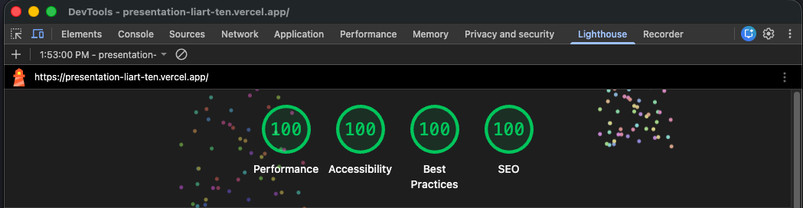

# Portfolio - Self Presentation

A modern, responsive portfolio website built with Next.js 16, TypeScript, Tailwind CSS, and Bun.

## 🚀 Features

- **Next.js 16** with App Router
- **TypeScript** for type safety
- **Tailwind CSS v4** for styling
- **Bun** as the runtime and package manager
- **Responsive Design** - Works on all devices
- **Dark Mode** support
- **Smooth Scrolling** navigation
- **SEO Optimized**

## 💡 Lighthouse Profiling



## 📦 Installation

```bash
# Install dependencies using Bun
bun install
```

## 🛠️ Development

```bash
# Start the development server
bun dev
```

Open [http://localhost:3000](http://localhost:3000) to view the site in your browser.

## 📁 Project Structure

```
.
├── app/
│   ├── layout.tsx       # Root layout with metadata
│   ├── page.tsx         # Homepage
│   └── globals.css      # Global styles
├── components/
│   ├── Header.tsx       # Navigation header
│   ├── Intro.tsx        # Intro section
│   ├── About.tsx        # About section
│   ├── Projects.tsx     # Projects showcase
│   ├── Skills.tsx       # Skills section
│   ├── Contact.tsx      # Contact form
│   └── Footer.tsx       # Footer
└── public/              # Static assets
```

## ✏️ Customization

### Update Personal Information

1. **Edit [app/layout.tsx](app/layout.tsx)** - Update metadata (title, description)
2. **Edit [components/Intro.tsx](components/Intro.tsx)** - Update your name and tagline
3. **Edit [components/About.tsx](components/About.tsx)** - Update your bio
4. **Edit [components/Projects.tsx](components/Projects.tsx)** - Add your projects
5. **Edit [components/Skills.tsx](components/Skills.tsx)** - Update your skills
6. **Edit [components/Contact.tsx](components/Contact.tsx)** - Update social links

### Add Your Own Styling

All components use Tailwind CSS. Modify the classes in each component file or update [app/globals.css](app/globals.css) for global styles.

## 🏗️ Build for Production

```bash
# Create an optimized production build
bun run build

# Start the production server
bun start
```

## 📝 Scripts

- `bun dev` - Start development server
- `bun build` - Build for production
- `bun start` - Start production server
- `bun lint` - Run Biome linter
- `bun format` - Format code with Biome

## 🚀 Deployment

### Deploy on Vercel

The easiest way to deploy:

1. Push your code to GitHub
2. Import your repository on [Vercel](https://vercel.com/new)
3. Vercel will automatically detect Next.js and configure the build
4. Your site will be live!

### Deploy on Other Platforms

This is a standard Next.js app and can be deployed on:
- Netlify
- Cloudflare Pages
- Railway
- Render
- Any platform that supports Node.js or Bun

## 🛠️ Technologies Used

- [Next.js 16](https://nextjs.org/)
- [React 19](https://react.dev/)
- [TypeScript](https://www.typescriptlang.org/)
- [Tailwind CSS v4](https://tailwindcss.com/)
- [Bun](https://bun.sh/)
- [Biome](https://biomejs.dev/) - Fast linter and formatter

## 📄 License

Feel free to use this template for your own portfolio!

---

Built with ❤️ using Next.js and Bun
